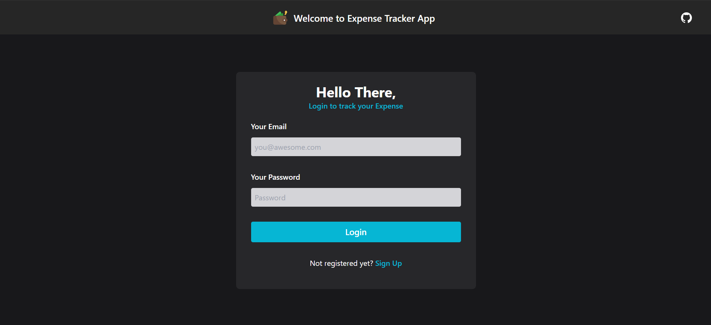

# 💸 Expense Tracker App

The Expense Tracker App is a web application designed to help users track their expenses efficiently. It allows users to add, edit, and delete expenses, providing a convenient way to manage their finances.

## Screenshots



## 🌟 Features

- Add new expenses with details such as name, description, and amount.
- Edit existing expenses to update their details.
- Delete expenses when they are no longer needed.
- View a list of all expenses with total amount calculated.
- Responsive design for use on both desktop and mobile devices.

## ⚙️ Technologies Used

- [React.js](https://react.dev/)
- [Firebase](https://firebase.google.com/) (for backend/database)
- [React Router](https://reactrouter.com/)
- [React Hook Form](https://react-hook-form.com/)
- [Zod](https://zod.dev/) (for form validation)
- [UUID](https://www.npmjs.com/package/uuid) (for generating unique IDs)
- [TailwindCSS](https://tailwindcss.com/)
- HTML

## 🛠️ Setup

1. Clone the repository:

```bash
git clone https://github.com/danielace1/expense-tracker-app.git
```

2. Install dependencies:

```bash
npm install
```

3. Run the development server:

```bash
npm run dev
```

4. Open your browser and visit `http://localhost:3000` to view the app.

## 🖥️ Usage

- Sign up for an account or log in if you already have one.
- Add your expenses using the form provided.
- Edit or delete existing expenses as needed.
- Log out when you're done.

## Contribution

Contributions are welcome! Please feel free to submit [pull requests](https://github.com/danielace1/expense-tracker-app/pulls) or [open issues](https://github.com/danielace1/expense-tracker-app/issues) for any bugs or feature requests.

## License

This project is licensed under the [MIT](./LICENSE)

## Author

- [Sudharsan](https://instagram.com/sudharsan_daniel)
